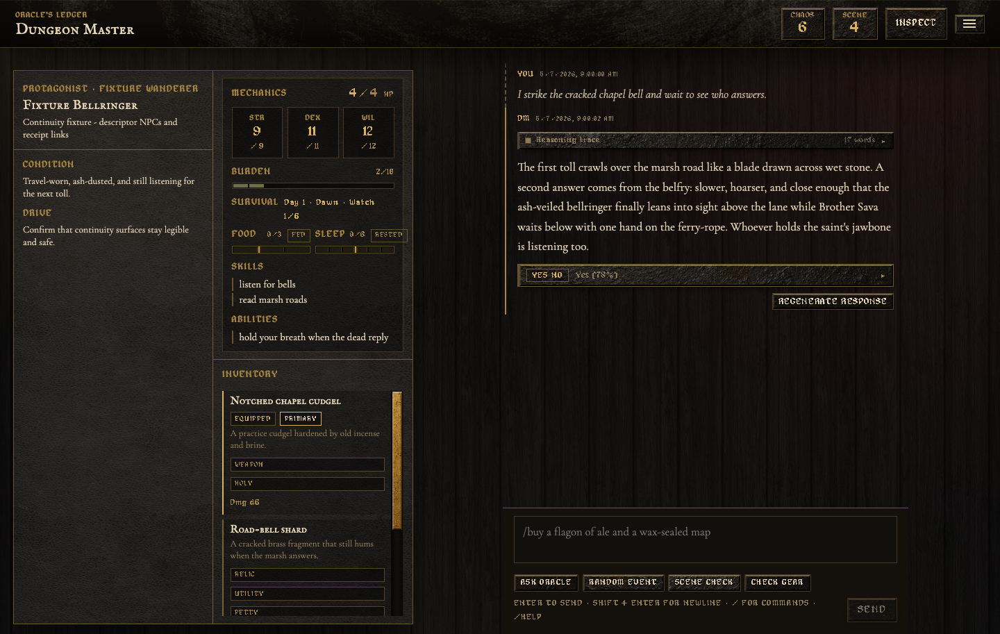
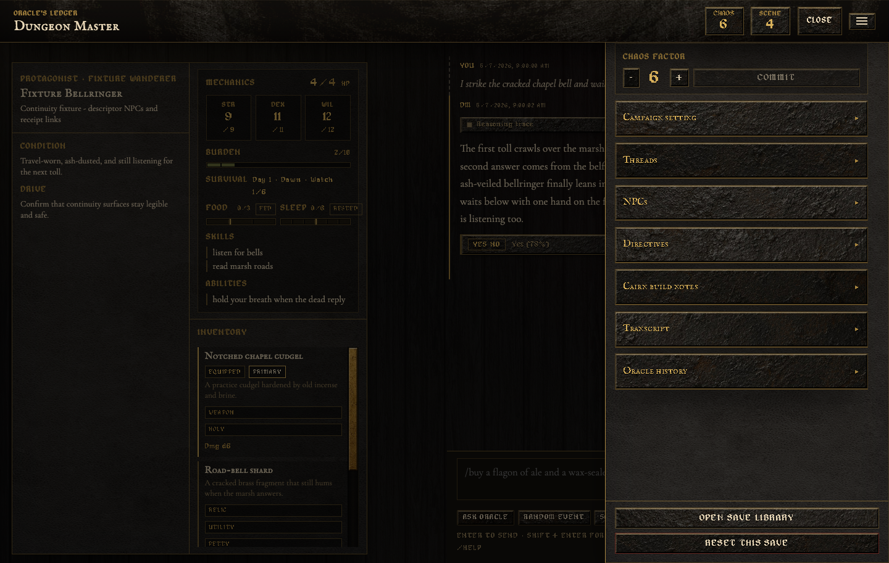
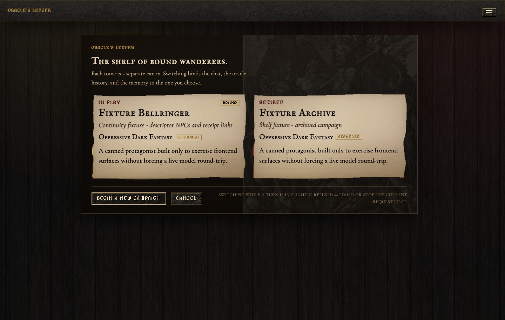
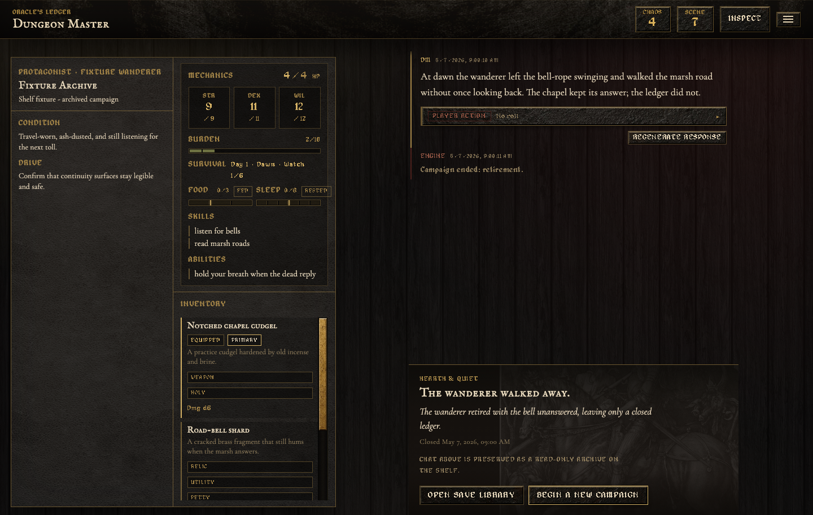

# Dungeon Master

A personal solo TTRPG harness where Python owns mechanics, validation, pipeline order, and canonical commits. LiteLLM-routed model workers produce typed semantic proposals and narration, but they never write campaign state directly. The frontend is a bespoke Svelte 5 grimoire UI; the backend is a FastAPI server.

[](https://github.com/armantark/Dungeon-Master/releases/tag/desktop-v0.1.2)
[](https://github.com/armantark/Dungeon-Master/releases/download/desktop-v0.1.2/Dungeon.Master_0.1.2_aarch64.dmg)
[](https://github.com/armantark/Dungeon-Master/releases/download/desktop-v0.1.2/Dungeon.Master_0.1.2_x64-setup.exe)
[](https://github.com/armantark/Dungeon-Master/releases/download/desktop-v0.1.2/Dungeon.Master_0.1.2_amd64.AppImage)
[](https://github.com/armantark/Dungeon-Master/releases)

## Screenshots

These captures use the isolated fixture save library (`dungeon-master-fixtures`) so the UI can be shown without mutating a live campaign.









## What It Does

- Manages local campaigns through `data/library.json`, with each save stored under `data/saves/<save_id>/`.
- Keeps canonical state in each save's `game_state.json`, events in `events.jsonl`, and recovery snapshots in `checkpoints/` and `turn-checkpoints/`.
- Builds bounded model context in a derived `memory.json` sidecar that can be rebuilt from canonical state and committed turns.
- Uses a deterministic oracle for yes/no questions, random events, and scene checks.
- Adds a Cairn 2e-inspired backend rules layer: `STR` / `DEX` / `WIL`, HP, armor, burden, item tags, saves, auto-hit damage, critical damage, scars, and recovery.
- Performs a one-time mechanics backfill for the current authored character when that character first becomes mechanically active, so existing setup work is preserved.
- Generates the opening scene, threads, hidden continuity cast, and oracle word banks when a campaign starts using the configured LLM.
- Uses model workers for typed action planning, prose, and bounded continuity proposals for threads, NPCs, inventory, and character effects.
- Keeps dice rolls, rules, validation, cancellation boundaries, and canonical state mutation in Python.
- Falls back to deterministic placeholder narration when no model is configured.

## Architecture

```text
+------------------+       HTTP / JSON or NDJSON       +-----------------------+
|  Svelte 5 + TS   |  <----------------------------->  |       FastAPI         |
|  store mirror    |             /api/*                | routes + stream sessions|
+------------------+                                   +-----------+-----------+
                                                                    |
                                                                    v
                                                       +-----------------------+
                                                       |      GameService      |
                                                       | ordered orchestration |
                                                       +-----------+-----------+
                                                                   |
                          +----------------------------------------+-------------------+
                          |                                        |                   |
                          v                                        v                   v
                 +------------------+                    +------------------+  +------------------+
                 | TurnRouter       |                    | Oracle / Cairn   |  | NarrativeEngine  |
                 | typed LLM plan   |                    | Python mechanics |  | prose model      |
                 +------------------+                    +------------------+  +------------------+
                                                                   |                   |
                                                                   +---------+---------+
                                                                             v
                                                      +----------------------------------+
                                                      | Post-narration reconciliation    |
                                                      | typed continuity proposals       |
                                                      +----------------+-----------------+
                                                                       |
                                                                       v
                                                      +----------------------------------+
                                                      | Python validation + commit       |
                                                      | StateStore + derived memory      |
                                                      +----------------+-----------------+
                                                                       |
                                                                       v
                                                      complete GameState replaces client mirror
```

The HTTP surface is intentionally thin: every committed mutation returns the complete `GameState`, so the frontend replaces its local mirror instead of reconciling partial diffs. Model outputs remain proposals until Python validates and commits them. Typed mechanics run only when the plan requires them; after narration, the continuity workers always get one bounded reconciliation opportunity and may return no changes.

### Source layout

- `src/dungeon_master/transport/http/`: FastAPI assembly, request schemas, runtime dependencies, route groups, and NDJSON response adaptation.
- `src/dungeon_master/application/`: typed turn-plan execution, post-narration reconciliation, and canonical turn commit workflows.
- `src/dungeon_master/domain/`: canonical Pydantic state and event contracts.
- `src/dungeon_master/generation/`: character and campaign generation contracts and workflows.
- `src/dungeon_master/mechanics/`: deterministic oracle, combat, character generation, inventory, and survival rules.
- `src/dungeon_master/llm/`: shared completion transport, typed planning, narration, explanation, and prompt fragments.
- `src/dungeon_master/memory/`: bounded context projection, retrieval, rendering, and the stable `MemoryManager` interface.
- `src/dungeon_master/persistence/`: atomic state files, checkpoints, events, derived memory, and save-library selection.
- `src/dungeon_master/entrypoints/`: console commands for the server, save backfill, and fixture library.
- `src/dungeon_master/config/` and `src/dungeon_master/infrastructure/`: runtime configuration and cross-cutting observability.
- `web/src/features/`: product-facing Svelte components grouped by combat, inspector, play, saves, settings, and setup.
- `web/src/contracts/`: TypeScript wire contracts grouped by backend domain; `lib/types.ts` is the stable import facade.
- `web/src/state/`: the rune-backed `GameStore` plus explicit campaign, save-library, settings, and streaming workflows; `lib/store.svelte.ts` is the stable import facade.

## Run

Two processes (one terminal per process is easiest):

```shell
# 1) backend
uv sync
uv run dungeon-master            # serves http://127.0.0.1:8000

# 2) frontend
cd web
npm install
npm run dev                      # serves http://localhost:5173
```

Open [http://localhost:5173](http://localhost:5173). Vite proxies `/api` to the FastAPI server.

The source-cited architecture map is a development-only frontend endpoint. It does not
bootstrap campaign state and does not require the backend:

```shell
cd web
VITE_ENABLE_ARCHITECTURE_MAP=true npm run dev
```

Open [http://localhost:5173/__dev/architecture](http://localhost:5173/__dev/architecture).
The exact path falls back to the normal app unless both Vite development mode and the
flag are active; production builds remove the map chunk entirely.

To run the backend with autoreload during development:

```shell
uv run dungeon-master --reload
```

## Desktop Beta

The repo now includes a Tauri v2 desktop shell in `web/src-tauri/`.

- The Tauri app spawns a bundled Python sidecar for the FastAPI backend.
- The sidecar writes saves/runtime settings/BYOK credentials into the OS app-data directory instead of the repo-local `data/` tree.
- The frontend resolves its API base at runtime, so browser dev still uses Vite's `/api` proxy while the desktop shell points directly at the local sidecar.

Local desktop commands:

```shell
# Build the backend sidecar binary Tauri expects
cd web
npm run sidecar:build

# Run the desktop shell in dev mode
npm run tauri:dev

# Build desktop bundles for the current host platform
npm run tauri:build
```

Rust is required for the local Tauri build/dev commands. The Python sidecar build alone does not require `cargo` to be on `PATH`.

GitHub desktop release automation lives in `.github/workflows/desktop-release.yml`.
It currently targets:

- macOS on native Apple Silicon and Intel runners
- Windows x64
- Linux x64

These beta artifacts are unsigned. macOS may require right-click Open / quarantine removal, and Windows may show SmartScreen warnings until signing is added later.

## Configure Models

The code default is OpenRouter Kimi K2.6. This checkout currently selects the app-global `gemini_split` preset in `data/runtime_settings.json`:

- `kimi`: use `openrouter/moonshotai/kimi-k2.6` for all backend LLM work
- `gemini_split`: `gemini/gemini-3.5-flash-preview` for structured routing/update work and `gemini/gemini-3.1-pro-preview` for narration plus heavier generation

The active preset is stored separately from `.env` in `data/runtime_settings.json` by default and can be read/updated through `GET /api/settings/llm` and `POST /api/settings/llm`.

Credential behavior now depends on how you run the app:

- Terminal/dev workflow: `.env` still works exactly as before.
- Desktop beta: if no usable provider key is present in the environment, the app prompts for a Gemini or OpenRouter key on first launch and stores it in a local runtime credentials file under the app-data directory.

When the Kimi preset is active, character interview, character drafting, and campaign bootstrap raise their token budgets above the base `.env` default because Kimi K2.6 Thinking spends a large part of the budget on reasoning before it writes visible output.

Copy `.env.example` to `.env` and fill in the provider keys you want available:

```shell
OPENROUTER_API_KEY=
OPENROUTER_API_BASE=https://openrouter.ai/api/v1
GEMINI_API_KEY=
LITELLM_MODEL=openrouter/moonshotai/kimi-k2.6
LITELLM_REASONING_EFFORT=auto
LITELLM_EXCLUDE_REASONING=false
LITELLM_NARRATION_TEMPERATURE=1.25
LITELLM_NARRATION_MAX_TOKENS=4500
LITELLM_TIMEOUT_SECONDS=600
LITELLM_MAX_RETRIES=2
OR_APP_NAME=Dungeon Master
DUNGEON_MASTER_STATE_PATH=data/game_state.json
DUNGEON_MASTER_RUNTIME_SETTINGS_PATH=data/runtime_settings.json
DUNGEON_MASTER_CREDENTIALS_PATH=data/llm_credentials.json
```

`DUNGEON_MASTER_STATE_PATH` remains the legacy-save and data-root anchor. `SaveLibrary` uses its parent directory for `library.json` and `saves/`, and migrates an existing flat save when it first initializes.

If you stay on the default Kimi preset, `LITELLM_MODEL` remains the active backend model slug. If you switch to `gemini_split`, the backend uses the fixed Gemini 3.x LiteLLM slugs above and ignores `LITELLM_MODEL` for those runtime-routed capabilities.

## Test

```shell
uv run ruff format --check .
uv run ruff check .
uv run python scripts/check_source_layout.py
uv run mypy src tests
uv run pytest
cd web && npm run format:check
cd web && npm run lint
cd web && npm run check
cd web && npm test
cd web && npm run build
```

Manual browser checks are documented in `docs/manual-testing.md`.

## Backend Mechanics API

The backend now exposes explicit Cairn-inspired mechanics routes in addition to `/api/turn`:

- `POST /api/cairn/save` — roll a `STR` / `DEX` / `WIL` save
- `POST /api/cairn/attack` — resolve outgoing player damage against target armor
- `POST /api/cairn/harm` — apply incoming damage to the player, including scars / critical damage when relevant
- `POST /api/cairn/recover` — breather, full rest, or week-scale recovery
- `POST /api/cairn/retreat` — resolve withdrawal from the active encounter
- `POST /api/cairn/acquire` — turn a natural-language acquisition into validated canonical inventory
- `POST /api/cairn/equip` — toggle item equipped state so armor / weapon semantics stay canonical

All of these return the full `GameState`, just like the rest of the API.

## Design Note

The oracle is inspired by solo game-master emulators (likelihood, chaos, scene pacing, events, threads, NPC prompts) but uses original tables — no proprietary text from Mythic GME 2e or any other system.
